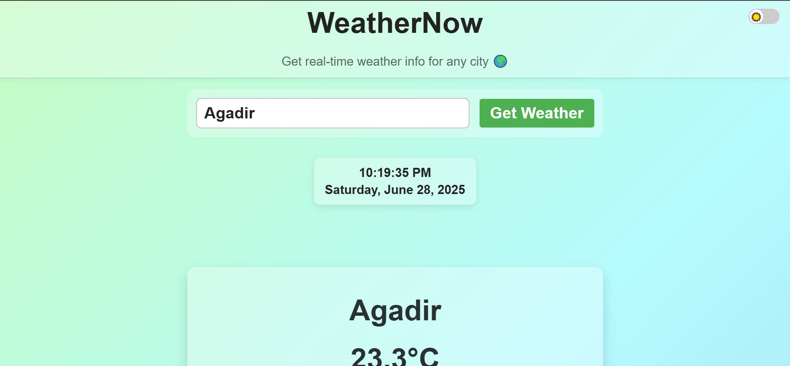
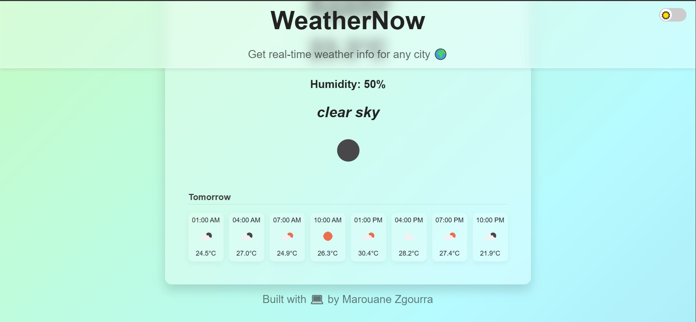

# WeatherNow 🌦️

**WeatherNow** is a sleek, modern, responsive weather web application that provides real-time weather information for any city worldwide. Built with HTML, CSS, and JavaScript using the OpenWeatherMap API, it also includes a live clock, dynamic 3-hour interval forecast, and light/dark mode support.

  


---

## 🔥 Features

- 🌍 Search weather by city name or auto-location (geolocation)
- ⏰ Live time and date display (auto-refresh every second)
- 🌡️ Current weather info: temperature, humidity, description, and icon
- 📆 3-hour interval forecast grouped by day (up to 8 points)
- 🌗 Dark/Light mode toggle with dynamic favicon change
- 📱 Fully responsive and mobile-friendly
- 🌈 Glassmorphism-style UI with smooth animations

---

## 🧪 Live Demo

🔗 [Live WeatherNow-App](https://marouane-zgourra.github.io/WeatherNow-App)

---

## 🚀 Getting Started

To run the project locally:

1. Clone the repository:

    ```bash
    git clone https://github.com/Marouane-Zgourra/WeatherNow-App.git
    cd WeatherNow-App
    ```

1. Open `index.html` in your browser.

> ✅ _No build tools or frameworks required._

---

## ⚙️ Technologies Used

- HTML5  
- CSS3 (with media queries + animations)  
- JavaScript ES6  
- [OpenWeatherMap API](https://openweathermap.org/api)  
- Icons by [Icons8](https://icons8.com/)  

---

## 🙏 Credits

- 👨‍💻 **Inspired by [Bro Code](https://www.youtube.com/@BroCodez)** — Huge thanks for his beginner-friendly weather app tutorial which laid the foundation for this project.  
- 📺 [Video link](https://youtu.be/VaDUGPMjzOM?si=61B7apKMjeeULq7L)  
- 💻 Built and customized by [Marouane Zgourra](https://github.com/Marouane-Zgourra) 👨‍💻

---

## 📜 License

This project is open source under the MIT License.  
Feel free to fork, use, or improve it with attribution.

---

> _Feel free to ⭐ this repo if you like it!_
